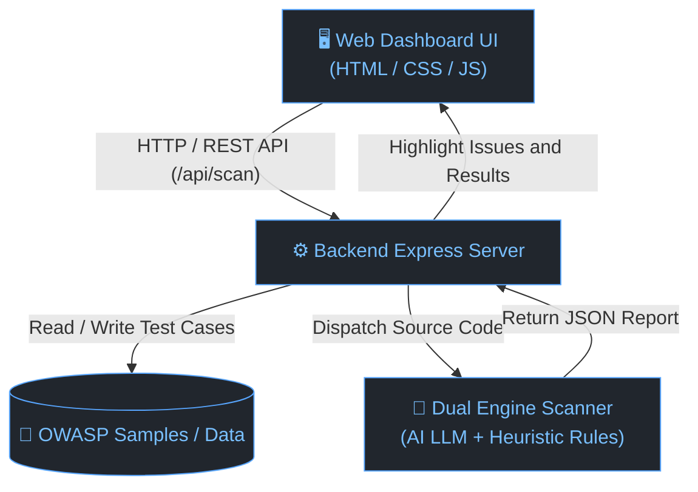

# 🛡️ AI Security Code Reviewer & Web Scanner

[](./LICENSE)
[](https://github.com/dtc245200494-hue/Automated_Code_Reviewer/releases)
[](https://nodejs.org/)

Hệ thống rà soát và phát hiện lỗ hổng bảo mật mã nguồn tự động theo tiêu chuẩn **OWASP Top 10** bằng Trí tuệ nhân tạo (AI). Cung cấp giao diện Web trực quan và bot tự động cho GitHub Actions.

---

## 🚀 Tính năng

- **Kiểm tra mã nguồn tức thì**: Dán code trực tiếp hoặc chọn nhanh 6 mẫu thử nghiệm OWASP Top 10 có sẵn.
- **Tải lên linh hoạt**: Hỗ trợ tải từng file mã nguồn lẻ hoặc nguyên thư mục dự án từ máy tính.
- **Quét GitHub Repository**: Quét trực tiếp kho lưu trữ GitHub bất kỳ thông qua đường dẫn URL.
- **Định vị & Bôi đỏ dòng lỗi**: Hiển thị số dòng, đánh dấu viền đỏ nổi bật tại dòng code bị lỗi và hỗ trợ nút nhảy nhanh đến vị trí lỗ hổng.
- **Báo cáo Tiếng Việt chi tiết**: Cung cấp phân tích cơ chế, kịch bản tấn công (PoC) và đoạn mã mẫu đã vá an toàn.
- **Động cơ phân tích kép**: Kết hợp giữa mô hình ngôn ngữ lớn (Groq Cloud LLM / OpenAI) và bộ phân tích Heuristic Engine chạy offline cục bộ.
- **Lịch sử quét**: Tự động lưu và tổ chức kết quả theo từng thư mục / file để tra cứu lại.

---

---

## 🏗️ System Overview



### Các thành phần chính:
- **Web Dashboard UI (Frontend)**: Giao diện trực quan (Cyber Dark theme, Split Layout VS Code) cho phép dán mã nguồn, tải thư mục dự án và quét trực tiếp kho lưu trữ GitHub qua URL.
- **Backend Express Server**: Đóng vai trò làm trung tâm điều phối, tiếp nhận yêu cầu từ Frontend, giao tiếp với cơ sở dữ liệu mẫu thử nghiệm và nạp dữ liệu từ xa (services/github.js).
- **OWASP Samples / Data**: Thư viện chứa các kịch bản kiểm thử mẫu về lỗ hổng bảo mật phổ biến để người dùng kiểm tra tức thì.
- **Dual Engine Scanner**:
  - **AI Live Engine**: Sử dụng Prompt Engineering chuyên sâu kết hợp mô hình LLM (openai/gpt-oss-120b, Groq Cloud / OpenAI) phân tích ngữ cảnh luồng dữ liệu.
  - **Heuristic Rule Engine**: Phân tích tĩnh dựa trên các mẫu nhận dạng lỗ hổng bảo mật, hoạt động độc lập ngay cả khi không có kết nối mạng.

---

## 🛡️ Danh mục lỗ hổng hỗ trợ (OWASP Top 10)

- **SQL Injection**: Ghép chuỗi truy vấn dữ liệu thô.
- **Cross-Site Scripting (XSS)**: Render dữ liệu người dùng không qua bộ lọc.
- **Hardcoded Secrets**: Lộ khóa bí mật, API Key, Token hoặc mật khẩu trong code.
- **OS Command Injection**: Thực thi lệnh hệ thống từ input chưa qua kiểm định.
- **Path Traversal**: Truy cập trái phép tệp tin hệ thống (../).
- **Insecure Deserialization**: Giải tuần tự hóa dữ liệu không tin cậy.
- **Broken Access Control & IDOR**: Lỗi kiểm soát quyền truy cập tài nguyên.
- **Cryptographic Failures**: Sử dụng thuật toán băm yếu (MD5, SHA-1) hoặc chế độ mã hóa không an toàn.

---

## 💻 Hướng dẫn cài đặt & Khởi chạy

### Yêu cầu
- Node.js >= 18.0.0
- npm >= 9.0.0

### Các bước thực hiện

1. **Clone repository**:
   ```bash
   git clone https://github.com/dtc245200494-hue/Automated_Code_Reviewer.git
   cd Automated_Code_Reviewer
   ```

2. **Cài đặt thư viện**:
   ```bash
   npm install
   ```

3. **Cấu hình môi trường**:
   Tạo file .env từ file mẫu .env.example:
   ```bash
   cp .env.example .env
   ```
   Cấu hình thông tin API trong file .env:
   ```env
   GROQ_API_KEY=your_groq_api_key
   MODEL=openai/gpt-oss-120b
   WEB_PORT=3000
   ```
   *(Nếu không cấu hình API Key, hệ thống sẽ tự động sử dụng Heuristic Engine để phân tích).*

4. **Khởi động ứng dụng**:
   ```bash
   npm start
   ```
   Mở trình duyệt tại: **http://localhost:3000**

---

## 📁 Cấu trúc thư mục

```text
Automated_Code_Reviewer/
├── data/                    # Mẫu kiểm tra bảo mật (OWASP Samples)
├── public/                  # Giao diện Web (HTML, CSS, JS)
├── services/                # Bộ xử lý AI Scanner và GitHub API
├── legacy-bot-action/       # Module bot cho GitHub Actions (lưu trữ)
├── .env.example             # File cấu hình môi trường mẫu
├── CHANGELOG.md             # Lịch sử các phiên bản
├── LICENSE                  # Giấy phép nguồn mở MIT (OSI-approved)
├── NOTICE                   # Thông báo quyền sở hữu & bản quyền thành phần
├── THIRD_PARTY_NOTICES.md   # Danh mục giấy phép của các thư viện bên thứ ba
├── package.json             # Khai báo dependencies (thư viện Node.js)
└── server.js                # Entrypoint của ứng dụng Web (file chạy chính)
```

---

## 📜 Open-Source License

Project-owned source code is licensed under the [MIT License](https://github.com/dtc245200494-hue/Automated_Code_Reviewer/blob/main/LICENSE). Third-party libraries, services, and model assets remain subject to their respective terms; see [NOTICE](https://github.com/dtc245200494-hue/Automated_Code_Reviewer/blob/main/NOTICE) and [THIRD_PARTY_NOTICES.md](https://github.com/dtc245200494-hue/Automated_Code_Reviewer/blob/main/THIRD_PARTY_NOTICES.md).

> [!IMPORTANT]
> **AI Security Bot** là một công cụ hỗ trợ rà soát và nâng cao nhận thức bảo mật trong quy trình phát triển phần mềm (DevSecOps). Hệ thống không thay thế hoàn toàn quy trình đánh giá an ninh mạng chuyên sâu, kiểm thử xâm nhập thực tế (Penetration Testing) hoặc các chứng chỉ kiểm định an toàn thông tin chuyên nghiệp.
